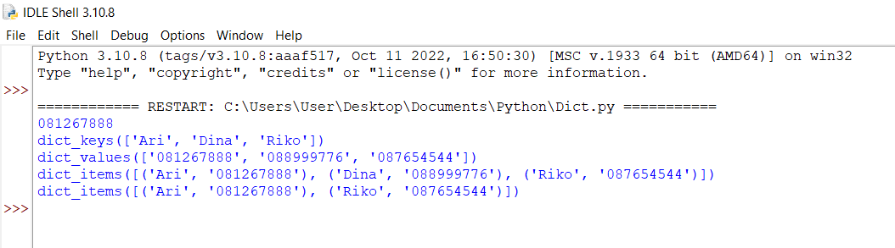

# PRATIKUM 6
### Latihan 1
```
telp = {}
telp['Ari'] = '081267888'
telp['Dina'] = '087677776'
print(telp['Ari'])
telp['Riko'] = '087654544'
telp['Dina'] = '088999776'
print(telp.keys())
print(telp.values())
print(telp.items())
telp.pop('Dina')
print(telp.items())
```

